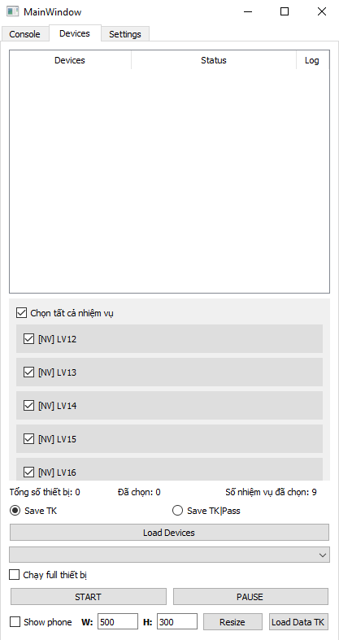
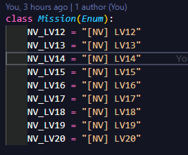
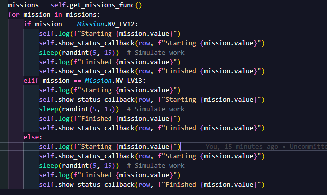

# KhanKhan Auto Device Manager

A PyQt5 desktop application for managing Android devices, selecting missions, and tracking per-device execution and logs.



Thêm các nhiệm vụ ở đây



Thêm các func chạy ở đây



## Chức năng chính

- **Load Devices**: quét danh sách thiết bị Android bằng `adbutils` và hiển thị trong bảng.
- **Select devices**: chọn thiết bị bằng checkbox để chạy cùng lúc.
- **Run All**: lựa chọn tất cả thiết bị và bắt đầu thao tác với 1 lần nhấn.
- **Mission selection**: chọn nhiều nhiệm vụ từ danh sách `Mission` với checkbox, bao gồm `Select all` cho nhiệm vụ.
- **Start / Stop / Pause / Resume**: điều khiển luồng `Worker` cho các thiết bị đã chọn.
- **Status updates**: cập nhật trạng thái từng thiết bị trong cột `Status` của bảng.
- **Device-specific log view**: mỗi dòng thiết bị có nút `Log` để mở dialog hiển thị log riêng cho thiết bị đó.
- **Console log**: tất cả log cũng được xuất vào widget Console và tệp `logs/app.log`.
- **Settings persistence**: các giá trị trong tab Settings được lưu vào `data/settings.json`.
- **Load Data**: nút `Load Data TK` cho phép chọn file JSON để đọc dữ liệu.
- **Phone resize controls**: giao diện cung cấp phần điều chỉnh kích thước điện thoại mô phỏng.

## Cấu trúc chính

- `app.py`: ứng dụng chính, GUI, logic điều khiển và quản lý log.
- `worker.py`: xử lý công việc đa luồng cho từng thiết bị.
- `gui/mainwindow_ui.py`: định nghĩa layout và widget của giao diện.
- `gui_helper/table_view.py`: hỗ trợ bảng thiết bị với checkbox và cập nhật dữ liệu.
- `utils/json_handle.py`: xử lý lưu/đọc cấu hình JSON.
- `icons/log.svg`: icon hiển thị cho nút xem log từng thiết bị.

## Cách chạy

1. Cài đặt môi trường Python với `PyQt5` và `adbutils`.
2. Chạy:
   ```bash
   python app.py
   ```
3. Sử dụng `Load Devices` để nạp thiết bị, chọn nhiệm vụ, rồi nhấn `START`.

## Ghi chú

- `adbutils` được sử dụng để lấy danh sách thiết bị thật.
- Log thiết bị được gom theo `serial` và hiển thị trong dialog riêng khi nhấn nút `Log`.
- Nếu worker đang chạy, `Load Devices` sẽ không cho làm mới danh sách.
